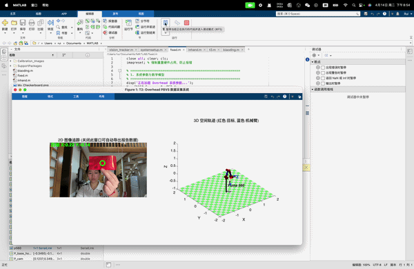

# PUMA 560 Position-Based Visual Servoing (PBVS) System

This repository contains a complete MATLAB-based **Position-Based Visual Servoing (PBVS)** simulation and control pipeline. It bridges live visual perception (via a monocular camera) with complex 6-DOF robotic kinematics.

## 🎬 System Demo


## 💡 Project Overview
This project implements a closed-loop electromechanical control system in MATLAB. Utilizing real-time image capture from a monocular camera, the system performs feature extraction and coordinate calculation to guide a virtual PUMA 560 manipulator in precise Cartesian space tracking of a moving target. 

The system effectively validates the engineering integration of perspective projection theory and robotic kinematics, while also diagnosing physical boundary limits (kinematic singularities) of the robotic interface.

## 🛠️ Core Technologies
* **Computer Vision & Calibration**
  * Extracted real camera intrinsics using Zhang's calibration method, achieving a highly accurate mean reprojection error of **0.34 pixels**.
  * Developed a real-time target locking algorithm based on HSV color space segmentation and morphological filtering (`bwareaopen`), ensuring robust tracking under varying lighting conditions.
* **Kinematics & Control**
  * Modeled the Forward Kinematics and homogeneous transformation matrices for the PUMA 560.
  * Mapped Cartesian space position errors into 6-DOF joint velocity commands using the **Jacobian Pseudoinverse**.
* **Dual-Mode Topology**
  * **Fixed Overhead Mode**: Configured a static extrinsic matrix ($T_{c \rightarrow b}$) for high-precision global tracking.
  * **Eye-in-Hand Mode**: Dynamically updated the end-effector pose to achieve closed-loop control from a moving perspective.
* **Singularity Diagnosis**
  * Experimentally captured and analyzed Jacobian rank deficiency failures when the manipulator approached physical workspace boundaries, providing empirical data to support the integration of Damped Least Squares (DLS) protection schemes.

## 📂 Repository Structure
```text
├── src/                     # Core MATLAB scripts
│   ├── systemsetup.m        # System parameter initialization & 3D topology generation
│   ├── biaoding.m           # Camera calibration image acquisition
│   ├── vision_tracker.m     # HSV visual feature extraction module
│   ├── fixed.m              # Main script: Fixed-camera closed-loop control
│   └── inhand.m             # Main script: Eye-in-hand closed-loop control
├── data/                    # Experimental data
│   ├── My_Checkerboard.png  # Original calibration board image
│   └── *.mat                # Trajectory logs and error convergence data
├── docs/                    # Technical documentation
│   └── Report.pdf           # Comprehensive theoretical derivation and experimental report
└── assets/                  # Static resources (images/videos)
